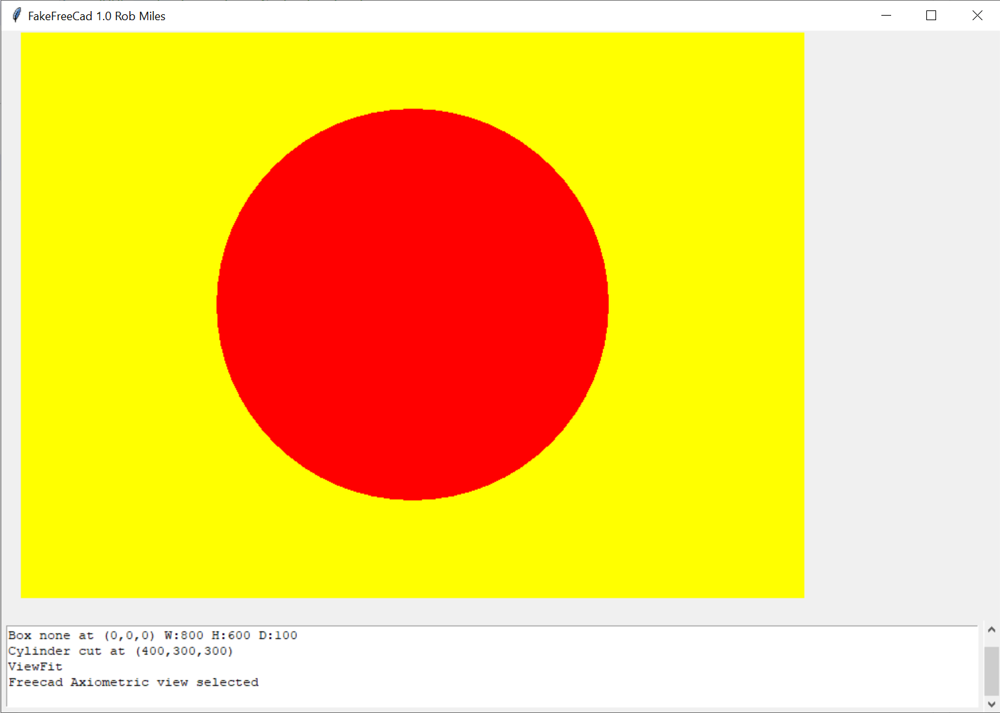
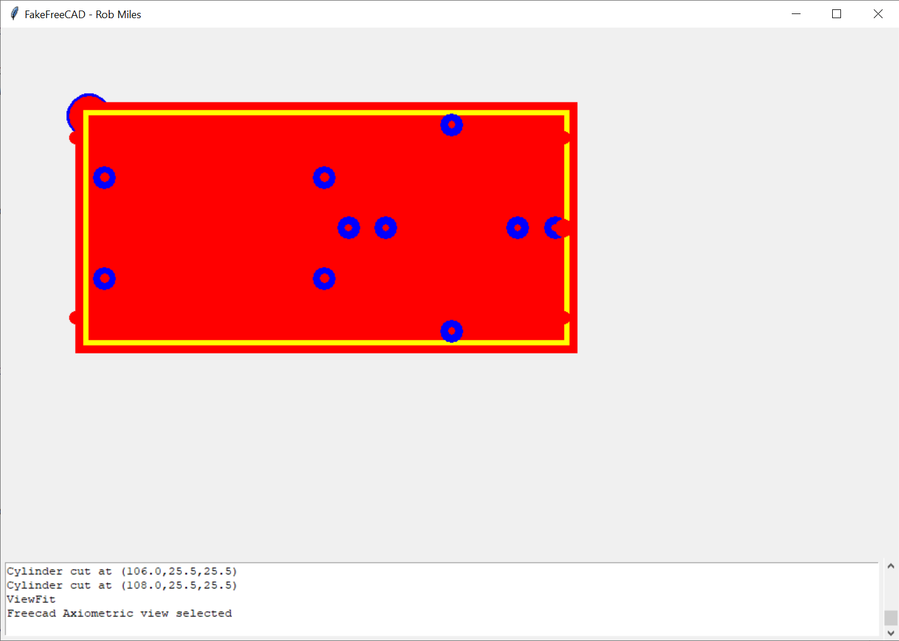

# FreeCADSimulator
A tiny Python environment for debugging FreeCAD Python macros. Include the FakeFreeCad program into your code and it simulates a subset of FreeCAD actions.

It will draw a top down 2D view of your design (sort of) but that's not the point. What it will do is make it easy to step through your program, view variables and do all the other things that you can't do in the FreeCAD macro editor.



This is the output from a very simple FreeCAD program:

```
from FakeFreeCad import *

### code from FreeCad starts here
### Make it into a function that can be called to make the part

def makePlate():

    plate = Part.makeBox(800,600,100)
    hole = Part.makeCylinder(200,200,Base.Vector(400,300,0))
    plate = plate.cut(hole)

    Part.show(plate)
    Gui.SendMsgToActiveView("ViewFit")
    Gui.activeDocument().activeView().viewAxometric()

### End of the FreeCad code

# Open the display

tk_display = TKDisplay(1000,600)

Display.setCanvas(tk_display)

Display.addMessageLine("Gadgetmaker 1.0 by Rob Miles")

# Call the FreeCad function to design the part

makePlate()

# Display the output

tk_display.mainloop()
```
I'm using it to create a case making program I'm working on. It will eventually appear on GitHub along with documentation.


Have fun

Rob Miles